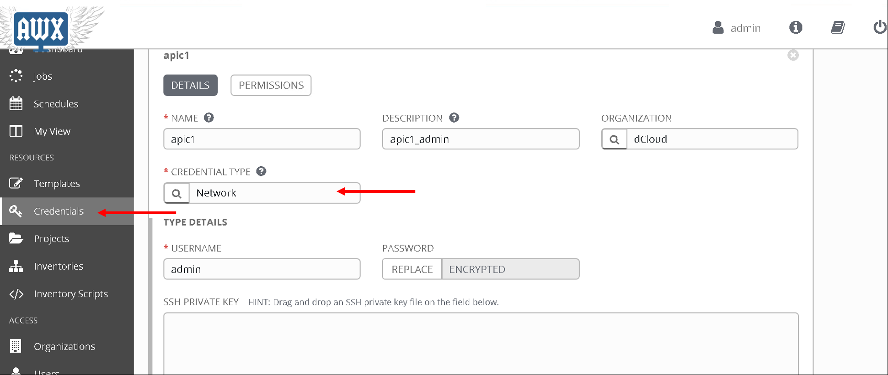
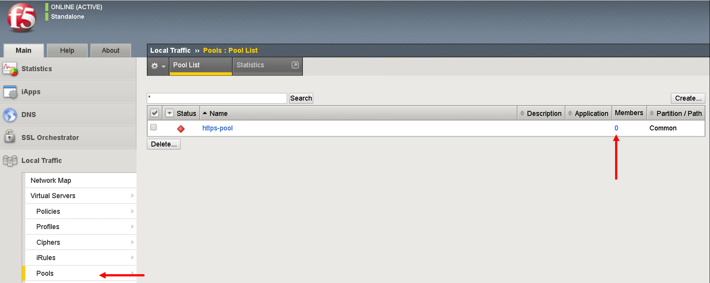

Ansible Tower
=============

Red Hat® Ansible® Tower helps you scale IT automation, manage complex deployments and speed productivity. Centralize and control your IT infrastructure with a visual dashboard, role-based access control, job scheduling, integrated notifications and graphical inventory management. And Ansible Tower's REST API and CLI make it easy to embed Ansible Tower into existing tools and processes.

As menitoned we will be using Ansible Tower to execute all of the playbooks/workflows.

Below is a overview of the flow of the lab

|

.. image:: ./_static/lab_flow.png

|

Let's start by going over the Tower configurations

Pre-configured
--------------

In this section we will go over some of the objects that are configured on Ansible tower and whats their purpose

Login to Ansible Tower. You will see the dashboard view by default. 

|


|

An Organization is a logical collection of Users, Teams, Projects, and Inventories, and is the highest level in the Tower object hierarchy.

Stucture of tower objects is as follows:

|


|

Lets start by taking a look at the organization 

Scroll down to Access and click on Organization on the left hand pane, there are 2 organizations present. We will be working with organization 'dCloud' which currently has 1 project defined.

|


| 

Next lets look at the Project configured. 

A Project is a logical collection of Ansible playbooks, represented in Tower. You can manage playbooks and playbook directories by either placing them manually under the Project Base Path on your Tower server, or by placing your playbooks into a source code management (SCM) system supported by Tower. 

We are going to use Git as our SCM for this lab

Click on 'Project' on the left hand pane

You will see two projects, click on 'demo_git_project'

|


|

Under that project you will notice

- Organization: 'dCloud'
- SCM type: Git
- SCM URL: "https://github.com/payalsin/f5_aci_dCloud_ansible.git" << url to fill what we are going to use >> (All the playbooks that are placed in this Git repo will be available in Tower for the user to execute)
- UPDATE REVISION ON LAUNCH - enabled (the Git Repo will be updated everytime a job using this repo is executed)

|


|

Next lets look at the inventory. 

Ansible playbooks can be run against multiple hosts, the inventory is used to define those hosts.

Click on 'Inventories' on the left hand pane. Click on 'Demo Inventory'

Then click on 'Groups' button on the Top.

|


|

There is one group 'aci', click on 'aci'. 

|


|

Then click on 'Hosts'.

|


|

Here the aci host has been defined against which we want to run the playbook. We we had more hosts under the group 'aci' this is the place where we would add that information

|


|

Next lets look at the credentials. The credentials used to login to the APIC are already defined here.

Click on 'Credentials' on the left hand pane. Click on 'apic1'

- Credential type: Network

|



|

This brings us to the end of this section. Next we are going to configure Job templates in Ansible tower

Creating Job templates
----------------------

A job template is a definition and set of parameters for running an Ansible job. Job templates are useful to execute the same job many times. Job templates also encourage the reuse of Ansible playbook content and collaboration between teams

We are going to create two job templates, one to configure the APIC and the second to configure the BIG-IP

Job template - APIC configuration
`````````````````````````````````

This job template pushes all the configuration needed to setup a service graph on the APIC. We are going to configure a 2 arm service graph to connect a F5 BIG-IP to a the Cisco APIC fabric

Information about service graph => Cisco®Application Centric Infrastructure (Cisco ACI™) technology enables you to insert Layer 4 through Layer 7 (L4-L7) functions using a concept called a service graph. This document describes the service graph concept and how to design for service insertion using the service graph.

With the service graph, Cisco ACI introduces innovations at both the data-plane and management levels.

Using the service graph, Cisco ACI can redirect traffic between security zones to a firewall or a load balancer, without the need for the firewall or the load balancer to be the default gateway for the servers. Cisco ACI can selectively send traffic to L4-L7 devices based, for instance, on the protocol and the Layer 4 port.
Service graph redirect offers many advantages:

- It eliminates the need to make the firewall or load balancers the default gateway.

- It avoids the need for more complex types of designs such as the Virtual Routing and Forwarding (VRF) instance–L4-L7–VRF design.

- It avoids to need to split Layer 2 domains (bridge domains) to insert, for instance, a firewall in the path.

- It allows you to redirect only a subset of the traffic based on the protocol and port.

- It allows you to filter traffic between security zones in the same Layer 2 domain (bridge domain).

- It allows you to scale the performance of the L4-L7 device by distributing traffic to multiple devices.

The service graph offers these advantages:

- The service graph can redirect traffic to L4-L7 devices, eliminating the need for more complex designs.

- The service graph automatically manages VLAN assignments.

- The service graph automatically connects virtual Network Interface Cards (vNICs).

- The configuration template can be reused multiple times.

- The service graph provides a more logical view and offers an application-related view of services.

- The service graph provides a better model for sharing a device across multiple departments.

For more information view the `white paper on service graph <https://www.cisco.com/c/en/us/solutions/collateral/data-center-virtualization/application-centric-infrastructure/white-paper-c11-734298.html>`_ 

A few more items that we are going to configure as part of the service graph

- **Contract**: An administrator uses a contract to select the type(s) of traffic that can pass between EPGs, including the protocols and ports allowed. If there is no contract, inter-EPG communication is disabled by default. There is no contract required for intra-EPG communication; intra-EPG communication is always implicitly allowed.

  - Present under Tenant -> Contracts
  
- **Logical device cluster** : A device cluster (also known as a logical device) is one or more concrete devices that act as a single device. A device cluster has cluster (logical) interfaces, which describe the interface information for the device cluster.

  - Present under Tenant -> L4-L7 Services -> L4-L7 Devices

- **Service graph template**: A service graph template is represented as two or more tiers of an application with the appropriate service functioninserted between the tiers

  - Present under Tenant -> L4-L7 Services -> Service Graph Templates

Below is an overall view of the APIC contructs

|


|

**Let's configure the job template**

Click on 'Templates' on the left hand pane, Click on the green '+' sign on the upper right corner. Select 'Job template'

|


|

- Name: 'Configure L4-L7 APIC'
- Inventory - 'Demo Inventory'
- Project - 'demo_git_repo'
- Playbook - 'apic_configure_l4l7.yml'
- Credential - 'apic1' (From the Credential type select 'Network' and then select 'apic1')

|


|

After all the values are filled:

|


|

Scroll to the bottom and save. 

Playbook details:

- There are templates defined using Jinga2 templating. For information on jinga2 refer to: https://jinja.palletsprojects.com/en/2.10.x/

  - Take a look at one example of the jinja2 we are going to be using - https://github.com/payalsin/f5_aci_dCloud_ansible/blob/master/ldev.j2
  
  - There is one jinja2 template for each object that is to be created in the APIC
  
  - This is payload that is going to be posted to the APIC. Anything in "**{{ }}**" is a variable, this variable will be substitued to its value once we run the playbook

- An ansible module called 'aci_rest' is used to POST the payload to the APIC rest end point
  
**Let's take a look at the playbook code**

.. code-block:: yaml

   - name: Configure ACI
     hosts: aci
     connection: local
     gather_facts: false
      
     tasks:

     # Jinja2 templates with variables are substitued with values and stored in the destination file
     - name: Create XML POSTS from templates
       template: src={{ item.src }} dest={{ item.dest }}
       with_items:
         - { src: 'ldev.j2',                      dest: 'ldev.xml' }
         - { src: 'contract.j2',                  dest: 'contract.xml' }
         - { src: 'service_graph_template.j2',    dest: 'service_graph_template.xml'}
         - { src: 'deviceSelectionPolicy.j2',     dest: 'deviceSelectionPolicy.xml'}
         - { src: 'apply_graph.j2',               dest: 'apply_graph.xml'}
         - { src: 'attach_cons_prov_contract.j2', dest: 'attach_cons_prov_contract.xml'}

     # Each file is send as payload to the REST API endpoint defined in the uri key below 
     - name: Execute POSTS
       aci_rest:
         action: "post"
         uri: "/api/node/mo/uni/tn-{{tenant_name}}.xml"
         config_file: "{{ item }}"
         host: "{{inventory_hostname}}"
         # This username/password is taken from the Credentials defined in ansible tower
         username: '{{ lookup("env", "ANSIBLE_NET_USERNAME") }}'
         password: '{{ lookup("env", "ANSIBLE_NET_PASSWORD") }}'
         validate_certs: "false"
       with_items:
        - "ldev.xml"
        - "contract.xml"
        - "service_graph_template.xml"
        - "deviceSelectionPolicy.xml"
        - "apply_graph.xml"
        - "attach_cons_prov_contract.xml"

Now let's create the second job template

Job template - BIG-IP configuration
```````````````````````````````````

We will create two job templates

1. Push network related configuration to the BIG-IP (Self-IP/Vlan)

   - Pull the VLAN information from the service graph template deployment from APIC and deploy on the BIG-IP

2. Push application related configuration to the BIG-IP (Nodes/Pool members/Virtual Servers)

**Let's start**

Follow the same steps as above to create the job templates and choose

First job template 

- Name - 'Configure BIG-IP Network'

- Playbook - 'bigip_configure_network.yml'

Rest all of the parameters same as before

|


|

Take a look at the code https://github.com/payalsin/f5_aci_dCloud_ansible/blob/master/bigip_configure_network.yml before proceeding. There are comments in the playbook to help understand the flow

Second job template

- Name - 'Configure BIG-IP Application'

- Playbook - 'bigip_configure_application.yml'

Rest all of the paramters same as before

|


|

Take a look at the code https://github.com/payalsin/f5_aci_dCloud_ansible/blob/master/bigip_configure_application.yml before proceeding. There are comments in the playbook to help understand the flow

Creating workflow
-----------------

Now let's take the three job templates we have created and move them to a workflow that can be executed via tower.

Refer https://docs.ansible.com/ansible-tower/latest/html/userguide/workflows.html for more details ansible tower workflows

Click on 'Template' from the left hand pane. Click on the green '+' button on the top left corner and select 'workflow template'

|


|

Enter Name: 'APIC-BIGIP-Workflow' and scroll to the bottom and click 'Save'. As soon as 'save' is clicked a new window will open for entering all the jobs that will be part of the workflow

|


|

Click on the green 'Start' button. From the right hand pane 

- Choose the Job template 'Configure L4-L7 APIC'
- Scroll down on the right hand pane and click on 'Select'

  |

  .. image:: ./_static/tower_create_workflow2.png

  |
  
- Now after the Start button you will see another node 'Configure L4-L7 APIC' added
- Hover over that node, another smaller green button will appear, click on the '+' sign
- From the right hand pane choose the job template 'Configure BIG-IP Network' and click select
- Hover over the newly added node, click on the smaller green '+' sign
- From the right hand pane choose the job template 'Configure BIG-IP Application' and click select
- Click Save on the button left hand corner of the screen
- Workflow has been created

To verify correctness you can click on the 'Workflow visualizer' to view the workflow created

|


|

You can click on the settings button to change the visual percentage

|


|

Now the next step is to provide input to the workflow. There are a few variables that are defined in the playbooks we need to provide input for those variables.

In a workflow we can specify the variables ina text box called as extra variables

|


|

Copy the below variables and copy it in the extra variables text box and click save

.. code-block:: yaml

   #Variables used in playbooks used by Job1, Job3 and Job3
   tenant_name: SJC
   logicalDeviceCluster_name: BIGIP-VE-Standalone

   #Login credentials
   bigip_ip: 198.18.128.130
   bigip_username: "admin"
   bigip_password: "admin"

   consumer_interface: '1.1'
   provider_interface: '1.2'

   #External Self-IP from the consumer subnet
   #Internal Self-IP from the provider subnet
   selfip_information:
   - name: 'External-SelfIP'
     address: '10.10.10.50'
     netmask: '255.255.255.0'
     vlan: 'consumer'
   - name: 'Internal-SelfIP'
     address: '10.193.102.50'
     netmask: '255.255.255.0'
     vlan: 'provider'
  
   vip_name: "http_vs"
   #Virtual IP address from the consumer subnet
   vip_ip: "10.10.10.100"
   pool_name: "https-pool"

Executing workflow
------------------
   
Before executing let's login to the APIC and BIG-IP and make sure there is no config to begin with

On the APIC go to Tenant SJC-> L4-L7 services, and look at all the menu options there should be nothing configured

|


|

On the BIG-IP go under the following menu options and make sure there is no configuration

- Network->Self-IP 

- Network->VLAN

|


|

- Local Traffic -> Virtual Server

- Local Traffic -> Pool

- Local Traffic -> Node

|


|

Now that we have the following covered:

- Workflow defined with 3 job templates
- Variable input given to workflow
- Configuration check done on APIC and BIG-IP 

Go back to the workflow and click launch

|


|

At this point the workflow will execute, one job template will be executed at a time. You can view that from the left hand pane. Click on the double arrow icon to view the expanded view

|


|

Once all the jobs are executed the workflow execution is complete. 

Click on 'jobs' on the left hand pane to see the workflow and the jobs executed

|


|

Let's look at what got configured

Verify execution
----------------

APIC
````

Login to the APIC and go to Tenant SJC->L4-L7 services, you will see the following configured

|


|

Expand deployed devices and go to FunctionNode. On the right hand pane under the properties section there is a scroll bar on the right hand side. Scroll to the bottom will you see the vlans

|


|

Take a note of the VLANS

.. note::

   The values you see might be different from the screen shot
   
BIG-IP
``````

Login to the BIG-IP and go to Network and Local Traffic Manager menus. View the Self-IP's/VLAN's and Virtual servies configured.

Look at the **VLANs**, the same vlan that is deployed in APIC is pushed to the BIG-IP. We did **NOT** provide any vlan information in the automation scripts. The scripts pulled the vlan information from this deployed graph and pushed it to the BIG-IP

|


|

**Self-IP**

|


|

**Virtual Servers**

|

.. image:: ./_static/tower_verify_bigip3.png

|

Click on the virtual server http_vs and then click on the resources tab. Here you will see the default pool assigned to it is https-pool

|


|

Click on LocalTraffic->Pools->https-pool, you will see no members have been added to the pool. In the next section we will see how to use a playbook to dynamically add and remove workload to this pool

|



|

At the point in a real environment you should be able to reach the virtual server IP address from the consumer EPG

We are still to add members to the Pool that will be load balanced when the consumer hits the virtual IP address

.. note::

   This is a simulator hence there is no traffic and the virtual IP address will not be reachable
   
   Next section will focus on adding workload/node members to the BIG-IP pool
   
**This brings us to the end of this section**