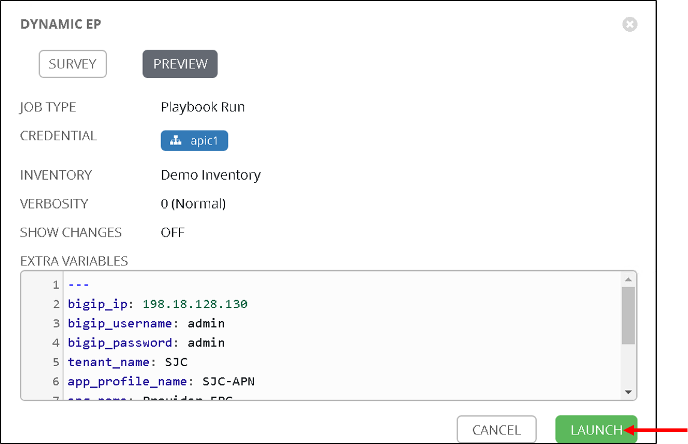

Dynamic End point attach/detach
===============================

This feature offloads the burden from a network administrator in terms of how to manage elastic workload. 

In this digital age the need to increase/decrease application workload has become more frequent to be able to handle the increase/decrease in traffic to the application.

Let's take a real world example of a service provider who wants to run a website. At moment t0, the website is unpopular and a single machine (most commonly a virtual machine) is sufficient to serve all web users. 
At moment t1, the website suddenly becomes popular and a single machine is no longer sufficient to serve all users. 
Based on the number of web users simultaneously accessing the website and the resource requirements of 
the web server, it might be that ten machines are needed. At this point nine additional machines vitual machines are bought online to serve all web users responsively.
These nine more web servers also need to added to the BIG-IP pool so that the traffic can be load balanced

At time t2, the website becomes unpopular again. The ten machines that are currently allocated to the website are mostly idle and a single machine would be sufficient to serve the few users who are accessing the website. 
The nine machines are deprovisioned and used for some other purpose.

Now in the ACI world when application workload is added it is learned by the ACI fabric and becomes a part of an Endpoint Group on the ACI fabric

In the BIG-IP world that workload is the members of the load balanced pool.

So to summarize:

- Endpoint group on APIC = Pool on the BIG-IP

- Endpoints in an endpoint group = Pool members on the BIG-IP ( application servers handling traffic)

So when workload is commissioned/decommisioned it needs to also be added/deleted to a pool member on the BIG-IP.

Using ansible lets automate the process.

|

|

In our environment we are going to be using the following:

- EPG on APIC => Provider-EPG
- Pool on BIG-IP => https-pool

Create a job template 
---------------------

Let's go to ansible tower and create a job template with the following parameters

- Name - 'Dynamic EP'
- Inventory - 'Demo Inventory'
- Project - 'demo_git_repo'
- Playbook - 'dynamic_ep.yml'
- Credential - 'apic1' (From the Credential type select 'Network' and then select 'apic1')

|

|

Scroll to the bottom and under the extra variables section add the following.

.. code-block:: yaml

  bigip_ip: '198.18.128.130'
  bigip_username: 'admin'
  bigip_password: 'admin'

|

.. image:: ./_static/tower_dynamic_job_template1.png

|

Scroll to the bottom and click save

Now let's also create a **Survey** for this job template. Surveys set extra variables for the playbook similar to 'Extra Variables' as we did aboove but in a user-friendly question and answer way. Surveys also allows for validation of user input

Click on 'Add Survey' button on the top right corner of the job template. 

|

.. image:: ./_static/tower_dynamic_survey.png

|

Start filling the following

- PROMPT: 'Tenant'
- ANSWER VARIABLE NAME: 'tenant_name'
- ANSWER TYPE: 'Text'
- DEFAULT ANSWER: 'SJC' (Let's provide a default value so that we dont have to enter it everytime we run the playbook)

|

|

Click +Add button , you will see Tenant variable added to the right hand pane now.

|

.. image:: ./_static/tower_dynamic_survey2.png

|

Continue this process for each extra variable that needs to be passed to the playbook

- PROMPT: 'Application Profile'
- ANSWER VARIABLE NAME: 'app_profile_name'
- ANSWER TYPE: 'Text'
- DEFAULT ANSWER: 'SJC-APN'

Click +Add button

- PROMPT: 'EndPoint Group'
- ANSWER VARIABLE NAME: 'epg_name'
- ANSWER TYPE: 'Text'
- DEFAULT ANSWER: 'Provider-EPG'

Click +Add button

- PROMPT: 'BIG-IP Pool Name'
- ANSWER VARIABLE NAME: 'pool_name'
- ANSWER TYPE: 'Text'
- DEFAULT ANSWER: 'https-pool'

Click +Add button

- PROMPT: 'BIG-IP Pool Port'
- ANSWER VARIABLE NAME: 'port_name'
- ANSWER TYPE: 'Integer'
- DEFAULT ANSWER: '80'

Click +Add button

Now you should see all the variables in the right hand pane. Scroll to the bottom and click 'Save'

|

.. image:: ./_static/tower_dynamic_survey3.png

|

Now we are at a point where 

- The job template is defined

- Variables are being passed through the extra variables section which do not need to be changed often

- Variables are also being passed though the survey

Before we launch the job template let's go back to the BIG-IP and make sure there are no pool members defined for the pool https-pool

Click on LocalTraffic->Pools->https-pool

|

.. image:: ./_static/tower_verify_bigip5.png

|

Let's also look at the endpoints learned on the APIC

Go to Tenant SJC->Application Profiles->SJC-APN->Application EPGs->Provider-EPG. Click on 'Operational' tab on the right hand side

Here you will see only one endpoint is learned at this point

|

|

Execute the job template
------------------------

Now let's go back to ansible tower and launch the job. Click on the job template and scroll to the bottom and click on 'Launch'

The survey will pop up since we have given Default values they fields will be pre-filled. If no default values were given these fields would be empty and the user could fill in those fields.

|

|

Click Next

Another pop up will appear indicating all the extra variables being passed (This is non editable). Click on 'Launch'

|

|

Examine the execution and wait for the job to be sucessful. After the job is sucessful go back to the BIG-IP and now view the members in pool https-pool. You will see one member added which is the member IP learned on APIC

Let's look at the playbook code before moving ahead. Looking at the tasks ONLY

.. code-block:: yaml
 
   tasks:
   # Setup the login information for the BIG-IP which will be passed to subsequent tasks
   - name: Setup provider
     set_fact:
      provider:
       server: "{{bigip_ip}}"
       user: "{{bigip_username}}"
       password: "{{bigip_password}}"
       server_port: "443"
       validate_certs: "no"

    # Get the end points learned for the Tenant/App/EPG 
    # and query the REST API end point below
    - name: Get end points learned from End Point group
      aci_rest:
        action: "get"
        uri: "/api/node/mo/uni/tn-{{tenant_name}}/ap-{{app_profile_name}}/epg-{{epg_name}}.json?query-target=subtree&target-subtree-class=fvIp"
        host: "{{inventory_hostname}}"
        username: '{{ lookup("env", "ANSIBLE_NET_USERNAME") }}'
        password: '{{ lookup("env", "ANSIBLE_NET_PASSWORD") }}'
        validate_certs: "false"
      register: eps
    
    # Parse the output from the above result and store the members in an array
    - set_fact: 
       epg_members="{{epg_members + [item]}}"
      loop: "{{eps | json_query(query_string)}}"
      vars:
       query_string: "imdata[*].fvIp.attributes.addr"
      no_log: True

    # Further filter the members to support only IPv4 members
    - set_fact:
       epg_members="{{epg_members | ipv4}}"
     
    # Add those members to the BIG-IP pool
    - name: Adding Pool members
      bigip_pool_member:
       provider: "{{provider}}"
        state: "present"
        name: "{{item}}"
        host: "{{item}}"
        port: "{{pool_port}}"
        pool: "{{pool_name}}"
      loop: "{{epg_members}}"

    # Query the BIG-IP pool for pool members - this is for deleting any members 
    # that are not part of the list above
    - name: Query BIG-IP facts
      bigip_device_facts:
        provider: "{{provider}}"
         gather_subset:
         - ltm-pools
      register: bigip_facts

    # Next few tasks to display the current pool members on BIG-IP
    - name: "Show members belonging to pool {{pool_name}}"
      set_fact:
       pool_members="{{pool_members + [item]}}"
      loop: "{{bigip_facts.ltm_pools | json_query(query_string)}}"
      vars:
       query_string: "[?name=='{{pool_name}}'].members[*].name[]"

    - set_fact:
       pool_members_ip: "{{pool_members_ip + [item.split(':')[0]]}}"
      loop: "{{pool_members}}"

    - debug: "msg={{pool_members_ip}}"

    # Compare the Pool members on the BIG-IP vs what is on the APIC and get the difference
    - set_fact:
       members_to_be_deleted: "{{ pool_members_ip | difference(epg_members) }}"

    - debug: "msg={{members_to_be_deleted}}"

    # Delete all the members that in the difference list
    - name: Delete Pool members
      bigip_pool_member:
       provider: "{{provider}}"
        state: "absent"
        name: "{{item}}"
        port: "{{pool_port}}"
        pool: "{{pool_name}}"
        preserve_node: yes
      loop: "{{members_to_be_deleted}}"

Add/Delete endpoints
--------------------

Now lets get APIC to learn/add more endpoints

Open the POSTMAN application which is present on the desktop

|

|

Once you login go to the 'Collections tab'

|

.. image:: ./_static/postman01.png

|

Go to collection **'EndPoint Management'**

Click on APIC Login request

- The POST request is directed towards the APIC

- The body of the POST has the login credentials

| 

|

Click Send

Next click on 'Add EndPoint SJC' request

Change the body to the following and click send

<fvRsPathAtt tDn="topology/pod-1/paths-102/pathep-[eth1/3]" encap="vlan-2003"/>

| 

|

Repeat it again to add a few more endpoints

- Change body to <fvRsPathAtt tDn="topology/pod-1/paths-102/pathep-[eth1/**4**]" encap="vlan-2003"/> and click send

- Change body to <fvRsPathAtt tDn="topology/pod-1/paths-102/pathep-[eth1/**5**]" encap="vlan-2003"/> and click send

- Change body to <fvRsPathAtt tDn="topology/pod-1/paths-102/pathep-[eth1/**6**]" encap="vlan-2003"/> and click send

- Change body to <fvRsPathAtt tDn="topology/pod-1/paths-102/pathep-[eth1/**7**]" encap="vlan-2003"/> and click send

- Change body to <fvRsPathAtt tDn="topology/pod-1/paths-102/pathep-[eth1/**8**]" encap="vlan-2003"/> and click send

- Change body to <fvRsPathAtt tDn="topology/pod-1/paths-102/pathep-[eth1/**9**]" encap="vlan-2003"/> and click send

Go back to APIC

- Tenant SJC->Application Profiles->SJC-APN->Application EPGs->Provider-EPG. Click on 'Operational' tab on the right hand side and verify all the new endpoints show up here

Go to Ansible tower

- Launch the playbook again. Wait till the playbook is sucessful

Go to the BIG-IP

- View the pool members under pool https-pool. You should now see 8 pool members

Let's also un-learn/delete a few endpoints from the APIC now

Go back to POSTMAN

- Go to request 'Delete EndPoint SJC'.

- View the body of the request here we are deleting one endpoint. Click Send

Go back to APIC

- Tenant SJC->Application Profiles->Application EPGs->SJC-APN->Provider-EPG. Click on 'Operational' tab on the right hand side and verify endpoints deleted does not show up there.

Go to Ansible tower

- Launch the playbook again. Once successful go to the BIG-IP and view the pool members under pool https-pool. You should now see 7 pool members.

Scheduling jobs
---------------

As you notice this is a bit of a manual process to keep running the ansible job to make sure the workload in APIC and on the BIG-IP are in sync.

One way to ease this burden is to create a schedule in Ansible tower which could run this playbook every minute or every hour which can be based on your application need and operational model

Let's take a look at how to create a schedule in ansible tower

Before we create a schedule lets look at the date and time currently on the ansible tower 

Open putty which is present in the toolbar. **Load** the tools server and click **Open**

|

|

- Login with credentials: admin/C1sco12345

- Run command 'date' once logged in and note it down
  
  - Example: "Tue Aug  6 20:35:35 UTC 2019"

Login into tower and go to the job template creted in this section - Dynamic EP, click on the button 'Schedules' at the top

The schedules page will open

Click on the '+' button and enter the following:

| 

|

- Name: 'Every_minute'

- Start Date: 'Based on the date above, choose the start date' - August 6th 2019

- Start time: 'Based on the time above, choose the start time that is few minutes later' - 20:40

- Local time zone: 'UTC' (type that in the textbox)

- Repeat frequency: 'Minute'

- End: 'After'

- Occurances: '5'

Click Save

| 

|

To view the schedule added you can click on 'Schedule' on the left hand pane of ansible tower

| 

|

To see the schedule in action click on 'Jobs' in the left hand pane. Here is where you see all the job executed and/or executing.

Once the time in the schedule is hit you will see your playbook executing.

| 

|

Since this playbook will run every minute any changes you make in terms of end point addition/deletion to the APIC will automatically be reflected on the BIG-IP

OPTIONAL:

A few things you can try while the scheduled job is running (You can change the schedule occurance to be more than 5 for trying the below)

- Delete a few more members from APIC using POSTMAN and see if its reflected on BIG-IP

- Add a few nodes directly on the BIG-IP using the LocalTraffic-> Nodes menu and see the behaviour once the playbook is run

Delete configuration
--------------------

Just like we created job templates and a workflow for configuring the APIC and BIG-IP. 

Lets Create job templates and workflow to execute deleting configuration

Create three job templates
 
- Name: Delete BIG-IP application, Playbook: cleanup/bigip_delete_application

  | 

  .. image:: ./_static/delete_bigip_application_job.png

  |  
	
- Name: Delete BIG-IP network, Playbook: cleanup/bigip_delete_network
  
  | 

  .. image:: ./_static/delete_bigip_network_job.png

  |  
	
- Name: Delete L4-L7 APIC , Playbook: cleanup/apic_delete_l4l7
  
  | 

  .. image:: ./_static/delete_apic_job.png

  |  
	
Create a workflow (The workflow will be reversed for deletion process)

- Delete BIG-IP Application -> Delete BIG-IP Network -> Delete APIC configuration
  
  | 

  .. image:: ./_static/delete_workflow.png

  |  
	
- Provide the same extra variables as provided while in the configure workflow
  
.. code-block:: yaml

   # Variables used in playbooks used by Job1, Job3 and Job3
   tenant_name: SJC
   logicalDeviceCluster_name: BIGIP-VE-Standalone

   #Login credentials
   bigip_ip: 198.18.128.130
   bigip_username: "admin"
   bigip_password: "admin"

   consumer_interface: '1.1'
   provider_interface: '1.2'

   #External Self-IP from the consumer subnet
   #Internal Self-IP from the provider subnet
   selfip_information:
   - name: 'External-SelfIP'
     address: '10.10.10.50'
     netmask: '255.255.255.0'
     vlan: 'consumer'
   - name: 'Internal-SelfIP'
     address: '10.193.102.50'
     netmask: '255.255.255.0'
     vlan: 'provider'

   vip_name: "http_vs"
   #Virtual IP address from the consumer subnet
   vip_ip: "10.10.10.100"
   pool_name: "https-pool"

Execute/launch the workflow

Once the workflow is successful verify that configuration has been deleted from the BIG-IP and APIC

.. note::
   
   Playbooks for delete workflow are placed here: https://github.com/payalsin/f5_aci_dCloud_ansible/tree/master/cleanup
      
**This brings us to the end of the Lab**