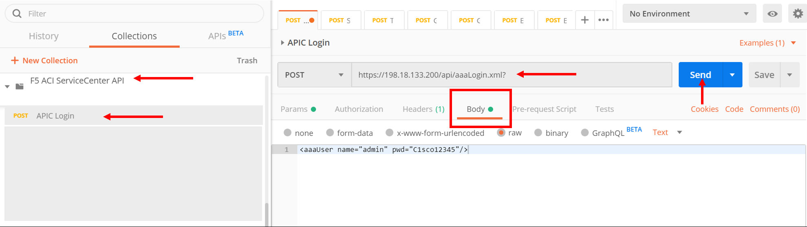
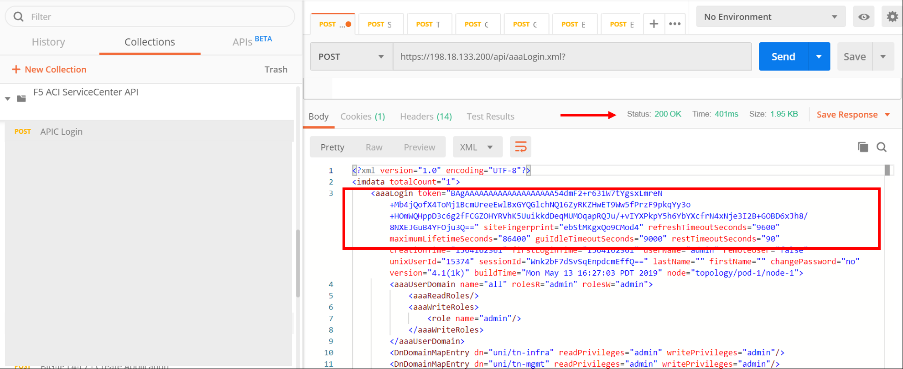
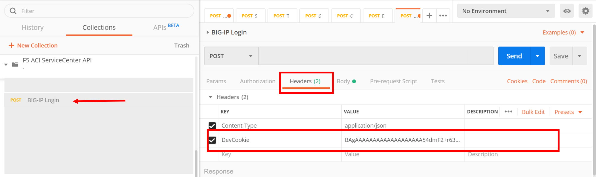
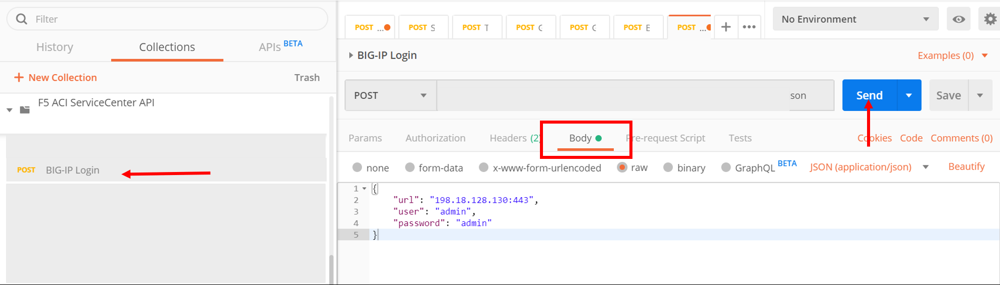

POSTMAN APIs
============

All the steps that we have performed so far can be done via a REST API call. In this section we will go over the process of how to use the F5 ACI ServiceCenter API's call to get health stats of VIPs/Pools/Nodes

We will be using POSTMAN to execute the API's. Steps that will be performed:

- Login to APIC to get the authentication token

  - This token will be used in the header field of the remaining API calls

- Login to BIG-IP 

- Get BIG-IP Virtual IP health statistics

- Get BIG-IP network configuration

**Lets begin**

Open the POSTMAN application which is present on the desktop

|

.. image:: ./_static/postman0.png

|

Once you login go to the 'Collections tab'

|

.. image:: ./_static/postman01.png

|

**Go to collection 'F5 ACI ServiceCenter API'**

APIC login
``````````

Click on APIC Login request

- The POST request is directed towards the APIC

- The body of the POST has the login credentials

|



|

Click Send

Look at the response and copy the value of token, example shown below

**If you cannot see the response make sure you adjust the response frame, sometimes its hidden below after you hit send**

|



|
   
.. note::

   The token value that you will see will not be the same. Copy value within the "". 
   
   In the above example it will be 
   
   BAgAAAAAAAAAAAAAAAAAAA54dmF2+r631W7tYgsxLmreN+
   Mb4jQofX4ToMj1BcmUreeEwlBxGYQGlchNQ16ZyRKZHwET
   9Ww5fPrzF9pkqYy3o+HOmWQHppD3c6g2fFCGZOHYRVhK5U
   uikkdDeqMUMOqapRQJu/+vIYXPkpY5h6YbYXcfrN4xNje3
   I2B+GOBD6xJh8/8NXEJGuB4YFOju3Q==
   
BIG-IP Login
````````````

Click on the BIG-IP Login request

Go to the Headers tab and under the Key DevCookie put the value of the token from the APIC login request

|



|

Take a look at the body of the POST. Here we are specifying the BIG-IP credentials that we want to log into. This is equivalent to adding a new device through the user interface

|



|

Click Send

You should get a response of 200 ok with the output of the login request similiar to the following

.. code-block:: json
 
   {
    "code": 200,
    "message": {
     "clustername": "none",
     "packageVersionJson": {
       "installRequired": false,
       "message": "Current version of f5-appscvs package is 3.12.0",
       "role": "admin"
     },
     "type": "VIRTUAL",
     "urls": [
       "198.18.128.130:443"
     ]
   }
  }
  
Get Virtual IP health statistics
````````````````````````````````

Click on the 'Visibility - VIP Table' postman request

Go to the Headers tab and under the Key DevCookie put the value of the token from the APIC login request

Take a look at the body of the POST. Here we are specifying the BIG-IP address as well as the partition. This is equivalent to viewing the VIP table from the visbility tab for a particualr parition on the user interface

Click Send

You should get a response of 200 ok with the output of the request similiar to the following

In the output you can view the VIP/Pool/Node member status, IP address and other infomration 

.. code-block:: json
 
   [
    {
        "vip": {
            "status": "offline",
            "name": "serviceMain",
            "partition": "DemoPartition",
            "enabled": "enabled",
            "address": "10.10.10.100:80",
            "fullpath": "/DemoPartition/DemoApplication/10.10.10.100:80"
        },
        "nodes": [
            {
                "status": "unknown",
                "name": "10.193.101.2",
                "app": {
                    "dn": "uni/tn-LAX/ap-LAX-APN",
                    "name": "LAX-APN"
                },
                "partition": "DemoPartition",
                "enabled": "enabled",
                "address": "10.193.101.2",
                "epg": {
                    "dn": "uni/tn-LAX/ap-LAX-APN/epg-Provider-EPG",
                    "name": "Provider-EPG"
                },
                "fullpath": "/DemoPartition/10.193.101.2",
                "tenant": {
                    "dn": "uni/tn-LAX",
                    "name": "LAX"
                }
            },
            {
                "status": "unknown",
                "name": "10.193.101.3",
                "app": {
                    "dn": "uni/tn-LAX/ap-LAX-APN",
                    "name": "LAX-APN"
                },
                "partition": "DemoPartition",
                "enabled": "enabled",
                "address": "10.193.101.3",
                "epg": {
                    "dn": "uni/tn-LAX/ap-LAX-APN/epg-Provider-EPG",
                    "name": "Provider-EPG"
                },
                "fullpath": "/DemoPartition/10.193.101.3",
                "tenant": {
                    "dn": "uni/tn-LAX",
                    "name": "LAX"
                }
            }
        ],
        "pool": {
            "status": "offline",
            "fullpath": "/DemoPartition/DemoApplication/web_pool",
            "partition": "DemoPartition",
            "enabled": "enabled",
            "name": "web_pool"
        }
    }
   ]
   
Get BIG-IP network information
``````````````````````````````

Click on the 'L2-L3 - Get Network Information' postman  request

Go to the Headers tab and under the Key DevCookie put the value of the token from the APIC login request

Take a look at the body of the POST. Here we are specifying the BIG-IP address as well as the APIC tenant and logical device. This is equivalent to viewing the Self-IP and VLAN information that has been stitched for a particular logical device cluster using the L2-L3 network stitching tab on the user interface.

Click Send

You should get a response of 200 ok with the output of the request similiar to the following

In the output you can view the Self-IP and VLAN infomration. 

.. code-block:: json
 
   {
    "cdevs": [
        {
            "interfaces": [
                {
                    "name": "Internal"
                },
                {
                    "name": "External"
                }
            ],
            "vmName": "BIGIP1-VM",
            "name": "Device1",
            "vcenterName": "dCloud-DC"
        }
    ],
    "svctype": "ADC",
    "devtype": "VIRTUAL",
    "vlans": [
        {
            "lif": "uni/tn-LAX/lDevVip-BIGIP-VE-Standalone/lIf-Internal",
            "disableConfig": {
                "disable": false,
                "ldev": null,
                "tenant": null
            },
            "appinfo": {
                "lif": "uni/tn-LAX/lDevVip-BIGIP-VE-Standalone/lIf-Internal",
                "name": "apic-vlan-b8b36edf",
                "interfaces": [
                    {
                        "tagged": "untagged",
                        "name": "1.2"
                    }
                ],
                "bigip": "198.18.128.130:443",
                "tag": 1171,
                "lIfCtxDn": "uni/tn-LAX/GraphInst_C-[uni/tn-LAX/brc-BIGIP-VE-Standalone-Contract]-G-[uni/tn-LAX/AbsGraph-2ARM-Template]-S-[uni/tn-LAX]/NodeInst-N1/LegVNode-0/EPgDef-provider",
                "selfips": [
                    {
                        "netmask": "255.255.255.0",
                        "traffic_group": "traffic-group-local-only",
                        "name": "apic-selfip-10.193.101.50",
                        "allow_service": "default",
                        "address": "10.193.101.50"
                    }
                ]
            },
            "insync": true,
            "deployed": true,
            "encap": "vlan-1171",
            "lIfCtxDn": "uni/tn-LAX/GraphInst_C-[uni/tn-LAX/brc-BIGIP-VE-Standalone-Contract]-G-[uni/tn-LAX/AbsGraph-2ARM-Template]-S-[uni/tn-LAX]/NodeInst-N1/LegVNode-0/EPgDef-provider",
            "lifName": "Internal"
        },
        {
            "lif": "uni/tn-LAX/lDevVip-BIGIP-VE-Standalone/lIf-External",
            "disableConfig": {
                "disable": false,
                "ldev": null,
                "tenant": null
            },
            "appinfo": {
                "lif": "uni/tn-LAX/lDevVip-BIGIP-VE-Standalone/lIf-External",
                "name": "apic-vlan-99821226",
                "interfaces": [
                    {
                        "tagged": "untagged",
                        "name": "1.1"
                    }
                ],
                "bigip": "198.18.128.130:443",
                "tag": 1003,
                "lIfCtxDn": "uni/tn-LAX/GraphInst_C-[uni/tn-LAX/brc-BIGIP-VE-Standalone-Contract]-G-[uni/tn-LAX/AbsGraph-2ARM-Template]-S-[uni/tn-LAX]/NodeInst-N1/LegVNode-0/EPgDef-consumer",
                "selfips": [
                    {
                        "netmask": "255.255.255.0",
                        "traffic_group": "traffic-group-local-only",
                        "name": "apic-selfip-10.10.10.50",
                        "allow_service": "default",
                        "address": "10.10.10.50"
                    }
                ]
            },
            "insync": true,
            "deployed": true,
            "encap": "vlan-1003",
            "lIfCtxDn": "uni/tn-LAX/GraphInst_C-[uni/tn-LAX/brc-BIGIP-VE-Standalone-Contract]-G-[uni/tn-LAX/AbsGraph-2ARM-Template]-S-[uni/tn-LAX]/NodeInst-N1/LegVNode-0/EPgDef-consumer",
            "lifName": "External"
        }
    ],
    "ldev": "uni/tn-LAX/lDevVip-BIGIP-VE-Standalone",
    "tenant": "LAX"
  }
  
  
For a complete list of the API's supported refer to `link <https://github.com/F5Networks/f5-aci-servicecenter/tree/master/api_collection>`_

**This brings us to the end of this section**