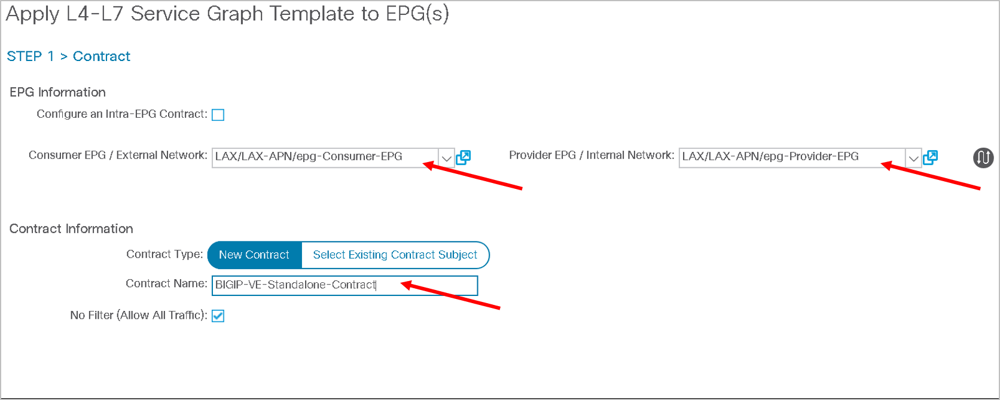

APIC configuration
==================

In this section we will review what is configured on the APIC and the L4-L7 contructs we will need to configure

L2-L3 Pre-configured
--------------------

- Two tenants LAX and SJC are configured.

- Each tenant has been assigned the following 

  - VRF
  
  - Two Bridge domains, one representing the consumer BD and the other representing provider BD
  
- Two Endpoint Group's, one representing the consumer (client) EPG and the other representing provider (server) EPG

- ApplicationProfile containing both the EPG's

- VMM integration has been done and the VMM domain has been assigned to the EPG's

  |
  
  .. image:: ./_static/apic_config_tenant1.png

  |
  
  .. image:: ./_static/apic_config_tenant2.png
  
  |

L4-L7 to be configured
----------------------

We are going to configure a 2 arm service graph to connect a F5 BIG-IP to a the Cisco APIC fabric

Cisco®Application Centric Infrastructure (Cisco ACI™) technology enables you to insert Layer 4 through Layer 7 (L4-L7) functions using a concept called a service graph. This document describes the service graph concept and how to design for service insertion using the service graph.

With the service graph, Cisco ACI introduces innovations at both the data-plane and management levels.

Using the service graph, Cisco ACI can redirect traffic between security zones to a firewall or a load balancer, without the need for the firewall or the load balancer to be the default gateway for the servers. Cisco ACI can selectively send traffic to L4-L7 devices based, for instance, on the protocol and the Layer 4 port.
Service graph redirect offers many advantages:

- It eliminates the need to make the firewall or load balancers the default gateway.

- It avoids the need for more complex types of designs such as the Virtual Routing and Forwarding (VRF) instance–L4-L7–VRF design.

- It avoids to need to split Layer 2 domains (bridge domains) to insert, for instance, a firewall in the path.

- It allows you to redirect only a subset of the traffic based on the protocol and port.

- It allows you to filter traffic between security zones in the same Layer 2 domain (bridge domain).

- It allows you to scale the performance of the L4-L7 device by distributing traffic to multiple devices.

The service graph offers these advantages:

- The service graph can redirect traffic to L4-L7 devices, eliminating the need for more complex designs.

- The service graph automatically manages VLAN assignments.

- The service graph automatically connects virtual Network Interface Cards (vNICs).

- The configuration template can be reused multiple times.

- The service graph provides a more logical view and offers an application-related view of services.

- The service graph provides a better model for sharing a device across multiple departments.

For more information view the `white paper on service graph <https://www.cisco.com/c/en/us/solutions/collateral/data-center-virtualization/application-centric-infrastructure/white-paper-c11-734298.html>`_ 

Below is an overall view of the APIC contructs

|


|

Also there are different F5 deployment options and the one we are covering in this section is a two-arm deployment model

Some highlights of a two arm deployment method:

- More than one interface of F5 Load balancer is used in this method of deployment.

- For Physical Servers(workload) default gateway is F5 Load Balancer IP Address.

- Asymmetric routing does not occurs in this method.

- Client IP address is retained

**Lets begin with the configuration of the L4-L7 constructs in APIC**

Logical device cluster 
``````````````````````

A device cluster (also known as a logical device) is one or more concrete devices that act as a single device. A device cluster has cluster (logical) interfaces, which describe the interface information for the device cluster.

Lets create a BIG-IP Unmanaged L4-L7 device under tenant indicating the BIG-IP VE device we are going to use as well as the interface association

Navigate to Tenant LAX -> Services -> L4-L7 -> Devices, right click and go to ‘Create L4-L7’ devices

|
 


|
  

Configure as follow:

- Uncheck the box "Managed"
  
- Name: "BIGIP-VE-Standalone"
  
- Service Type: "ADC" 
  
- Device Type: "Virtual"
  
- VMM Domain: Select the VMM domain already integrated in APIC where BIG-IP VE is hosted- "My-vCenter"
  
- Content-Aware: "Single"
  
- Devices:
  
  - Click on the '+' sign at the top right side under the devices section
      
    |
	  
    .. image:: ./_static/ldc1.png

    |
	  
  - Enter Device name: "Device1"

  - Select VM from drop down list: "dCloud-DC/BIGIP1-VM"
	
    |
  
    .. image:: ./_static/ldc2.png

    |
	
  - Click next. Click on the '+' sign on the top right hand of the interfaces section
	
    - Enter name: "External", VNIC: "Network adaptor 2" and click update
	  
    - Click the '+' sign again and add another interface
	  
    - Enter name: "Internal", VNIC: "Network adaptor 3" and click update
	  
    - Click "OK"
	    
      |
	
      .. image:: ./_static/ldc3.png

      |

      .. note::
      
         - Network adaptor 1 on the BIG-IP device is used as the MGMT interface
		 
         - Network adaptor 2 as defined above is used for External (client) traffic 
		 
         - Network adaptor 3 as defined above is used for Internal (server) traffic
		 
  - Back to the main screen of the logical device cluster click on the '+' sign on the top right under the Cluster section
	
    - Enter name: "External", Concrete interfaces from dropdown list select "Device1/External" and click update
	
    - Click the '+' sign again and add another cluster interface
	  
    - Enter name: "Internal", Concrete interfaces from dropdown list select "Device1/Internal" and click update
	  
    - Click "Finish"

      |
		
      .. image:: ./_static/ldc4.png

      |
	
Service graph template
``````````````````````
A service graph template is represented as two or more tiers of an application with the appropriate service function
inserted between the tiers

Lets create a 2 ARM service graph template with the F5 BIG-IP service in the middle of the service chain

Navigate to Tenant LAX -> Services -> L4-L7 -> Service Graph Templates, right click and go to ‘Create L4-L7 Service Graph Templates’

|


|

Drag and drop the logical device cluster from the left hand pane into the right hand pane
 
| 


|
  
Enter 

- Service Graph Name: "2ARM-Template"

- ADC: "Two-Arm"

|  


|
  
Click submit
 
Apply the service graph
```````````````````````

Now that the service graph template is created we will apply/deploy this service graph template with the following paramters:

- Consumer: Consumer-EPG

- Provider: Provider-EPG

- New Contract: BIGIP-VE-Standalone-Contract

Right click on the service graph template '2ARM-Template' and click on 'Apply L4-L7 Service Graph Template'

|

.. image:: ./_static/apply_sgt1.png

|
   
Select the consumer and provider EPG from the dropdown list, provide contract name as shown below and click next

|



| 

Map cluster interface with the BD. Select the appropriate cluster interface as shown below

|


| 

Click FINISH

.. note ::

   The above steps will complete the network stitching on the ACI side.
   
   No F5 BIG-IP related configuration.

Verify the deployment
`````````````````````

Lets look at the configuration that got deployed once the service graph template was applied

Navigate to L4-L7-> Deployed Graph Instances, on the right hand pane you will see the deployed graph which is in **applied** state. If there is an error in deploying this state would not be applied but something like **failed-to-apply**

|


| 

Expand Deployed Graph Instances, expand BIGIP-VE-Standalone-Contract-2ARM-Template-LAX and click on Function Node. On the right hand pane under properties there is a small scroll bar on the right , scroll down till you see 'Function Connectors' and note the encap for consumer and provider assigned

The VLANS you see might be different from the screen shot below

|


| 

.. note ::

   **We will be pushing this VLAN configuration to the BIG-IP using the F5 ACI ServiceCenter in the exercises to follow**

.. note ::

   This VLAN got assigned dynamically by APIC based on the VMM integration assigned at the time we configured the logical device cluster
   
   You can view the dynamic VLAN range allocated to the VMM domain by navigating to the Fabric tab on APIC.Then click on the Access policies tab->Pools->VLAN->dCloud_VLAN_Pool (this range will match what got allocated above)
 
   |
   
   .. image:: ./_static/dynamic_vlan.png

   | 
   
**This brings us to the end of this section** 
