F5 ACI ServiceCenter configuration
==================================

In this section we are going to cover the different use cases covered by the application.

While going through the exercises think of yourself as a network admin who along with managing the network is also looking to expand his/her skills in applying those network operations practises for supporting DevOps.

A few points about the BIG-IP being used in this lab:

- Virtual edition that is integrated with APIC through the VMM domain

- Version 13.1

- `RPM for AS3 <https://github.com/F5Networks/f5-appsvcs-extension/tree/master/dist>`_ installed.
   .. note::

      This is needed for the L4-L7 application services use case.

      Application Services 3 Extension (AS3) is a flexible, low-overhead mechanism for managing application-specific configurations on a BIG-IP system. AS3 uses a declarative model, meaning you provide a JSON declaration rather than a set of imperative commands.

**Let's Begin by adding the BIG-IP device that we are going to manage using the application**

Open a browser to point to http://localhost:4200 (There is also a shortcut present on the browser as F5 ACI ServiceCenter)   

|

  .. image:: ./_static/docker_screen_initial.png

|
  
.. note::

   The APIC used here is a simulator and an ACI App cannot be loaded on the simulator.

   In an environment where there is a physical APIC (standalone or cluster), the F5 ACI ServiceCenter will be present as a software image that is uploaded to the APIC
       
   **In this lab environment we are using a APIC simulator, so the F5 ACI ServiceCenter will be accessed from outside of the APIC**
   

Add a new BIG-IP device (Device Login)
--------------------------------------

BIG-IP devices that need to be managed by the app will have to be added to the App. The APIC has no information about what the IP or the crendetials are for the BIG-IP. If you remeber while configuring the service graph all we mentioned was the physically connectivity and not the credentials.

So our first step is to add the BIG-IP device to be managed

1. In the top left of the F5 ACI ServiceCenter, click :guilabel:`+ NEW DEVICE`. A login prompt appears.

2. Enter the BIG-IP device credentials.
   - 198.18.128.130 (admin/admin)
   
   |
   
   .. image:: ./_static/login_screen.png

   |
   
3. Log in to the BIG-IP device. The device hostname, redundancy state, and config sync state are displayed at the top of the page, along with three tabs: Visibility, L2-L3 Stitching, and L4-L7 App Services.

   |
   
   .. image:: ./_static/login_screen1.png

   |

Configure the network on BIG-IP
-------------------------------

Lets start by creating the VLAN's and the Self-IP's on BIG-IP to complete the network configuration

.. note ::

   This is a simulator and there will be no traffic 
   
In this exercise we are going to use the logical device cluster we created earlier on the APIC
   
Create VLAN and Self IP
```````````````````````
Now from the previous section we deployed the service graph and noted the dynamic VLAN assigned to the service graph.

These are the same VLANs that we need to configure on the BIG-IP to achieve network stitching. That is what we are going to do next.

1. Click the L2-L3 Stitching tab.

2. From the :guilabel:`Logical Device` list, select the logical device created earlier in the lab 'LAX | BIGIP-VE-Standalone'
  
   |
   
   .. image:: ./_static/l2l3-1.png

   |
   
   The APIC information (click on the '+' sign) is which is READ ONLY displayed: Tenant, Concrete Devices and Interfaces, and Device Type (Physical/Virtual). 
   
   You can also view a list of VLANs configured under the APIC Logical Device in the :guilabel:`Available` box.
  
   |
   
   .. image:: ./_static/l2l3-2.png

   |
   
3. Select the vlans and move them to the :guilabel:`Selected` box.

   The details of all VLANs in the selected box are displayed below. 
   
   Keep in mind which is internal and external interface as shown below

   After selecting the VLANS click :guilabel:`Manage Selected`. 
   

   |
   
   .. image:: ./_static/l2l3-3.png

   |

   .. note::
   
      - A VLAN configuration form is displayed to add VLANs and information for one or more self IPs. 
      
      - For VLAN, the fields to be configured are: 
        
        - Tag 
        
        - Interface
      
      - For self IPs, the fields to be configured are 
      
        - Address 

        - Netmask 

        - Traffic-group
       
        - Port-lockdown
      
      - Whether the interface is tagged or untagged depends on its device type. For a Physical device, VLANs are tagged and for virtual devices, VLANs are untagged. This option isn’t configurable (In this lab since we are using a virtual edition the interface will be untagged)
      
      - The only options available for port lockdown are All, None, and Default.

4. The VLAN will also mention if its internal or external interface which is relevant for what interface you would assign on the BIG-IP

   Enter the following values - **your VLAN values might differ from 1002 and 1001**
  
   - For VLAN tag 1002 (representing **internal** interface on BIG-IP)

     - Interface 1.2 (since this is internal interface use the interface 1.2)

     - Click on 'Add SELF IP' button
	
       - Address - 10.193.101.50
	  
       - Netmask - 255.255.255.0
	  
       - Traffic Group - traffic-local-group-only
	  
       - Port lockdown - Allow Default
	  
     |
	 
     .. image:: ./_static/l2l3-4.png

     |
   
   - For VLAN tag 1001 (representing **external** interface on BIG-IP)

     - Interface 1.1 (since this is external interface use the interface 1.1)
	
     - Click on 'Add SELF IP' button
	
       - Address - 10.10.10.50
	  
       - Netmask - 255.255.255.0
	  
       - Traffic Group - traffic-local-group-only
	  
       - Port lockdown - Allow Default
         |	   
     
         .. image:: ./_static/l2l3-5.png

         |
	 
Click :guilabel:`Submit`

The BIG-IP device has the same VLANs configured as the APIC LDEV VLAN and L2-L3 stitching is complete.

The F5 ACI ServiceCenter is a stateful application, all the network information is now stored in the application. 
Deletion and modification to the configuration can be done via the App itself

|

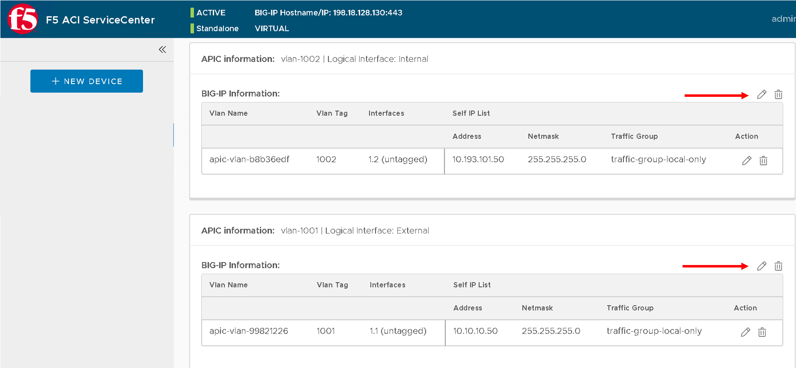

|

.. note ::

   Your VLAN tag name might be different from what is present in the screen shot above
   
View the VLAN and Self IP configuration on BIG-IP
`````````````````````````````````````````````````

Let's take a look at what got configured on the BIG-IP

Login to the BIG-IP (198.18.128.130 admin/admin) - you can also use the shortcut present in the browser

Navigate to Network->VLANS

|

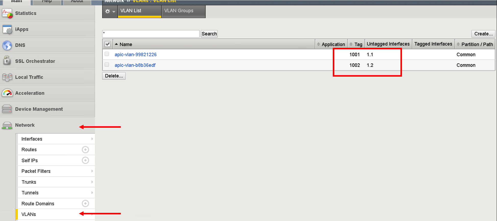

|

Navigate to Network->Self IPs

|

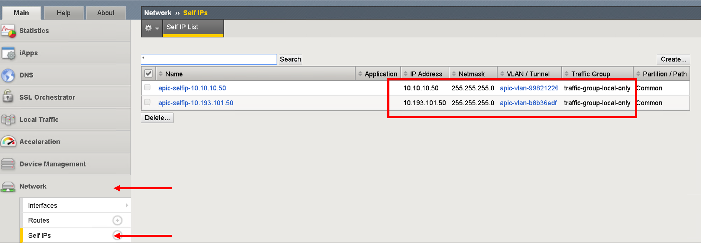

|

Our network stithcing is now complete. We have deployed service graph on APIC and have assigned the corresponding network on the BIG-IP. 

Now let's go to the visibility section of the application 
   
Navigate the Visibility tab
---------------------------

Lets go back to F5 ACI ServiceCenter applciation. Click on the visibility tab which is open by default. The contents of all tables are populated by pulling information from the BIG-IP and then co-relating it to configuration on the APIC

In the F5 ACI ServiceCenter :guilabel:`Partition` list, :guilabel:`Common Partition` is selected by default. If any other partition is selected, for example the :guilabel:`Sample Partition`, the selected table shows entries that belong to both the sample partition and common partition.

View VLAN table
```````````````

This table will pull vlan information from the BIG-IP and co-relate it to a logical device cluster and tenant on the APIC

1. Click the Visibility tab 

   In the :guilabel:`Table` list, the VLAN table is selected by default.

2. The table shows all the VLANs (vlan encaps) from the BIG-IP device that have a corresponding Logical Device|Tenant entry on the APIC.

   |
   
   .. image:: ./_static/vlan_table.png

   |
   
   .. note ::
   
     The table does not show VLANs from BIG-IPs that don't have corresponding APIC entries.
   

View VIP table
``````````````

**Currently this table is empty since we have not configured any VIPs/Pool/Pool members on the BIG-IP**

This table will pull virtual servers/pools and pool members from the BIG-IP and co-relate is to a Tenant/Application Profile and Endpoint group on the APIC

Click the Visibility tab, and then from the :guilabel:`Table` list, click the :guilabel:`VIP` table.


.. note::
   
   This table will show all the VIPs (virtual servers) from the BIG-IP device. 
   
   It also shows the pool and nodes for this VIP. For each node, it displays the corresponding Tenant, Application, and End Point
   Group entries from APIC.
   
   Virtual IP's will be present ONLY if below conditions are met
   
   - Virtual IP has a Pool assigned to it
   
   - Pool assigned has pool members assigned to it
   
   - Pool member IP's matches end point IP's learned by APIC (we will go into this into detail on this in coming sections
   
View Node table
```````````````

**Currently this table is empty since we have not configured any VIPs/Pool/Pool members on the BIG-IP**

This table shows all the Nodes from this BIG-IP device, provided they have a corresponding Tenant Application and EPG entry on the APIC. 

It also displays the pools that the node belongs to. For each pool, it shows the corresponding VIPs (virtual servers).

Click the Visibility tab, and then click the :guilabel:`Node` table from the Table list.

.. note::
   
   Node IP's will be present ONLY if below conditions are met
	 
   - Node member IP's matches end point IP's learned by APIC (we will go into this into detial on this in coming sections). What this also means is that a specific node is not operational on the APIC and hence not displayed in the Node table

Configure the application on BIG-IP
-----------------------------------

Now lets configure some VIPs/Pool and nodes on the BIG-IP and see how they are reflected in the visibility tables.

An application on BIG-IP is configured using AS3. For information on how to define a declaration, see https://clouddocs.f5.com/products/extensions/f5-appsvcs-extension/latest/userguide/.

In simple terms its a two step process:

- End state of the configuration to be achieved is defined as JSON payload

- Payload is send to a single REST end point on the BIG-IP

.. note::
   
   Only one REST API call to BIG-IP vs multiple API calls to the BIG-IP for configuring the BIG-IP
   
Now when you click the L4-L7 App Service tab, two subtabs are displayed (BIG-IP and Application). The Application tab is selected by default. It has a box that displays the current AS3 declaration on this BIG-IP device.

Create a partition and application 
``````````````````````````````````

Click on the Application tab


1. Two new fields, :guilabel:`Partition Name` and :guilabel:`Application Name`, are
   displayed. 
    
   From the dropdown list select "Create New Partition", the partition and application fields will be activated and values need to be entered
  
   |
   
   .. image:: ./_static/l4l7-1.png

   |
   
   Enter valid input for both. The new partition can’t be created without providing an application name.
   
   Enter the following:
   
   - Partition Name : 'DemoPartition'
   
   - Application Name: 'DemoApplication'

   |
   
   .. image:: ./_static/l4l7-2.png

   |
   
2. Stub(sample) code is displayed in the textbox, edit the values as below:
   
   - <<YOUR_VIP_HERE>> to 10.10.10.100
   
   - <<YOUR_POOL_MEMBER_HERE>> to 10.193.101.2

   - <<YOUR_POOL_MEMBER_HERE>> to 10.193.101.3

   Example below:
   
   .. code-block:: json
   
      {
        "class": "Application",
        "template": "http",
        "serviceMain": {
        "class": "Service_HTTP",
        "virtualAddresses": [
            "10.10.10.100"
        ],
        "pool": "web_pool"
      },
        "web_pool": {
         "class": "Pool",
         "monitors": [
            "http"
         ],
         "members": [
            {
                "servicePort": 80,
                "serverAddresses": [
                    "10.193.101.2",
                    "10.193.101.3"
                ]
            }
         ]
       }
     }
	 
3. Click :guilabel:`Submit`.

A new partition and application is created on the BIG-IP device.

View the current AS3 configuration on the BIG-IP
````````````````````````````````````````````````

Let's also view the configuration that got pushed to the BIG-IP

1. Login to the BIG-IP from the browser - there is a shortcut (198.18.128.130 - admin/admin)

2. Go to the top right hand corner and select 'DemoParition' from the partition drop down list

   |
   
   .. image:: ./_static/bigip_after_as3-1.png

   |
   
3. Navigate to Local Traffic -> Virtual Servers

4. Click on serviceMain, scroll down and view all the configurations for the virtual server. Some were passed as parameters to the payload others were treated as default

   |
 
   .. image:: ./_static/bigip_after_as3-2.png

   |
   
5. Click on resources and see the default pool 'web_pool' assigned to it

   |
   
   .. image:: ./_static/bigip_after_as3-3.png

   |
   
6. Navigate to Local Traffic- > Pools -> Pool List. Click on 'web_pool'. Click on the Members tab and view the pool members configured

   |
   
   .. image:: ./_static/bigip_after_as3-4.png

   |
   
Troubleshoot using visibility
-----------------------------

We have deployed the application on the BIG-IP, let's see how the visbility tab can provide us some insight for troubleshooting

Scenario1 - All nodes not showing up
````````````````````````````````````

Let's go back to the visibility tab and select 

- Table: 'Node Information' and Partition: 'DemoPartition'

You will notice that only one pool member is present here even though we added two members

You can collapse the left hand pane to get an expanded view of the visibility table

|

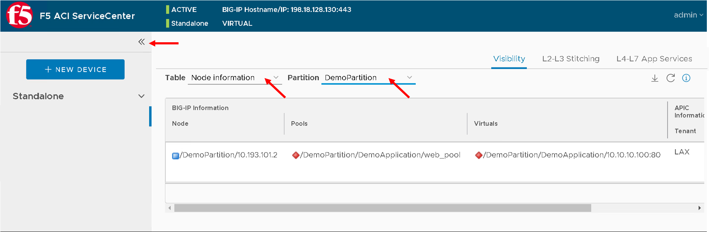

|
   
Let's look at why that is. As stated earlier ONLY those nodes will show up that have been learned by the APIC fabric.

For us the pool members/workload is present in the Provider-EPG so lets 

- Navigate to the Tenant LAX-> ApplicationProfile-> LAX-APN->Application EPGs->Provider-EPG

- Click on the 'Operational' tab on the right hand pane

- We see only one member that is learned here which matches 10.193.101.2 that we see from the visibility section of the F5 ACI ServiceCenter

|

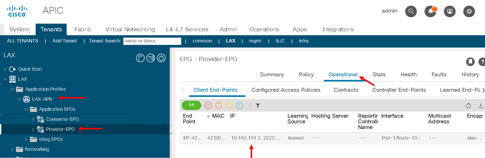

|

Now let's make the APIC learn the second endpoint. We are going to do this through automation

Open POSTMAN application that is present on the desktop

|  

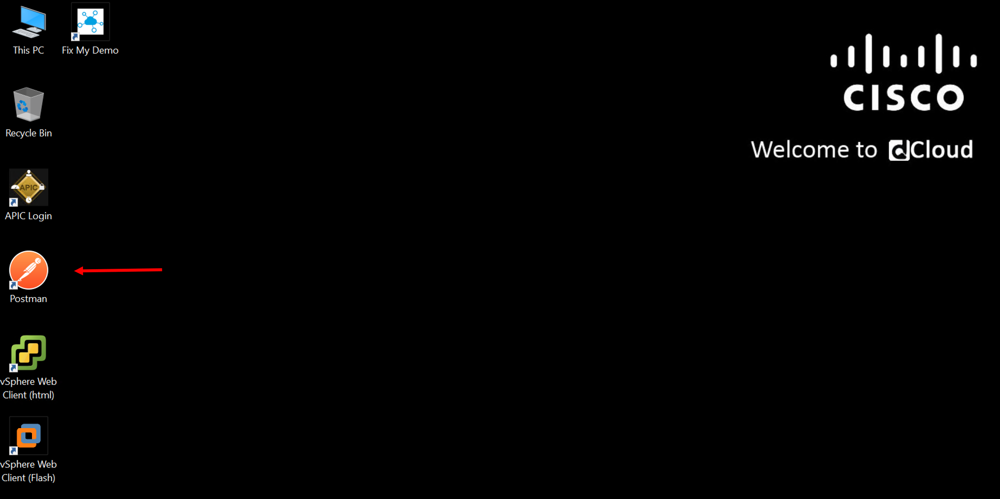

|
  
Go to the 'Collections tab'

|
  
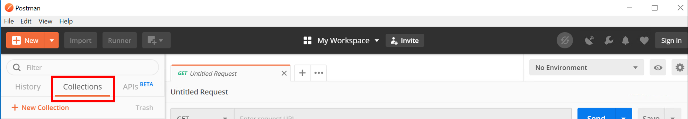

|
  
Go to Collection 'EndPoint Management'

Go to 'APIC login' and click on Send. This is creating a login token for the remaining API calls

|
  
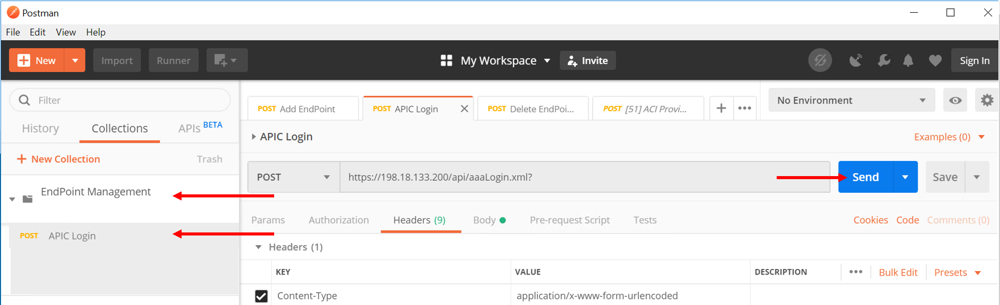

|

Go to 'Add EndPoint LAX' and click Send

|
  
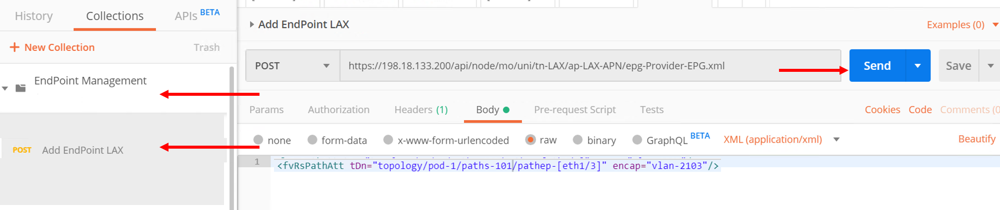

|
  
Now go back to APIC and refresh the end points under the Operational tab. There should be two endpoint now 10.193.101.2 and 10.193.101.3

|

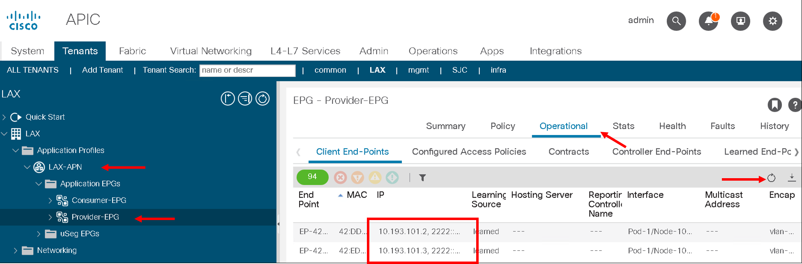

|

Let's go back to the F5 ACI ServiceCenter and see what the visibility node tables shows now

It now gives us information about both the nodes and to what tenant/app/epg to they belong to on the APIC

|

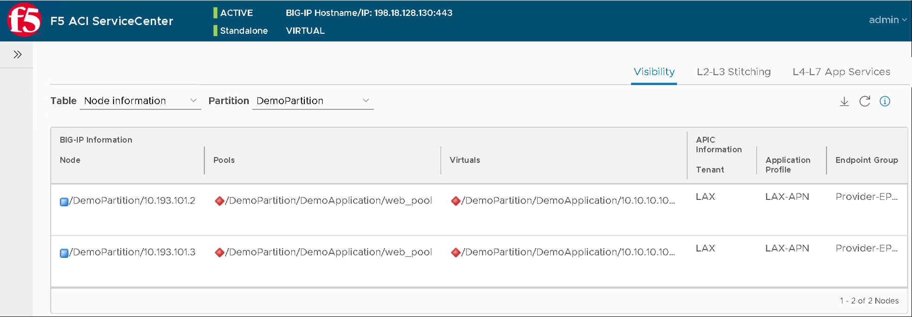

|

Let's take a look at the 'VIP table', the VIP table gives information from the BIG-IP about which pool the VIP belongs to and the pool memebers belonging to the pool. 

It's essentially similiar information as the node table but in a different format so that its easier for a user to consume the information regarding the BIG-IP configuration

|

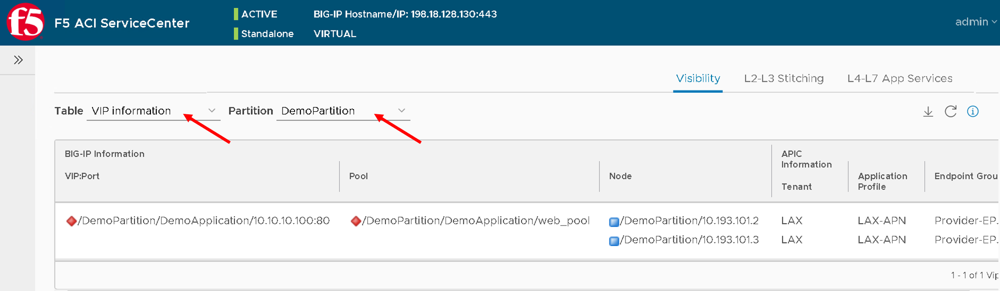

|

**This brings us to the end of this section** 
