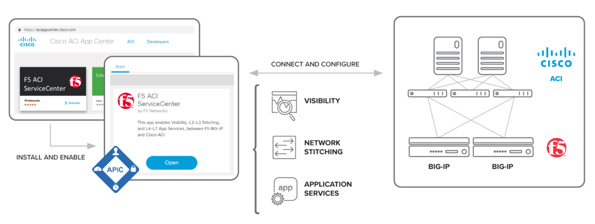

F5 ACI ServiceCenter lab Guide
==============================

This lab guide will cover the Cisco ACI and F5 BIG-IP integration using the Cisco DC App Center platform.

The Cisco App Center platform is an ACI capability where customers, developers, and partners are able to build apps to simplify, enhance, and better visualize their use cases – similar to what is done in mobile world apps today

Originally your smartphone performed phone functions like voice calling and text messaging. Now with third party applications (Apps), your smartphone becomes a part of your life with apps like collaboration, health, stocks, maps, etc.  Think of mobile as an infra, and apps are enabling smartness.

Thats exactly the way to view the ACI App Center, the App Center is a platform/infra to develop applications which add smartness to your deployment/environment

I am sure this left you thinking, what apps could there be in networking and more speifically what can an app do for an integration with Cisco ACI and F5 BIG-IP.

The integrated app solution named "F5 ACI ServiceCenter" focusses on the following use cases:

===================== ============================================================================================================================================================
Feature               Capability                                                         
===================== ============================================================================================================================================================
Visibility            View BIG-IP network elements like VLANs, VIPs, and nodes, and correlate them with APIC information like Tenant | App | EPG.

L2-L3 Stitching       Facilitates L2-L3 stitching between APIC logical devices and BIG-IP (CRUD operations for VLAN, self IP, and default gateway).                                                

L4-L7 App Services    Create custom application definitions with the help of a declarative interface.        
                                                                                                 
===================== ============================================================================================================================================================

We will go in detail on each of these use cases in the sections to come and discuss the value it adds to your L2-L7 integration and solution

Overview

|
	

|

For more details on the integration refer to https://www.f5.com/cisco

|
	
.. toctree::
   :caption: F5 ACI ServiceCenter dCloud Lab Guide
   :maxdepth: 2
   :hidden:

   intro.rst
   apic_configuration.rst
   app_configuration.rst
   manage_l2l3.rst
   api_postman_app.rst
   ansible_app.rst
   one_arm.rst
   troubleshoot.rst