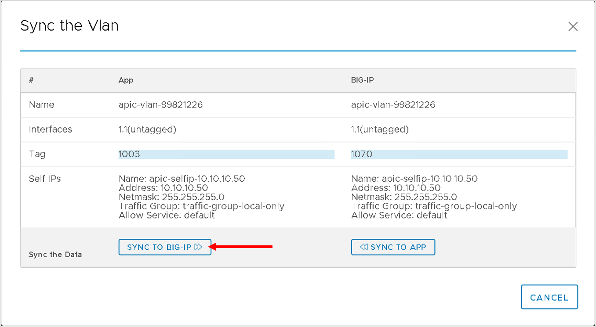

Manage L2-L3 configuration
==========================

Now that we have performed some Day0 configuration for the network and also the application. 

Lets look at how we can managing DayN configuration using the F5ACI ServiceCenter.

Re-deploy service graph
```````````````````````
Assume someone from your team also has access to the APIC and without understanding the impact re-deploys the service graph which has already been stitched to the BIG-IP.

Let's take a look at how the application and help rectify the issue.

First let's redeploy the graph. Login to the APIC and navigate to Tenant LAX->Contracts->Standard->BIGIP-VE-Standalone-Contract->Subject

Scroll to the bottom and find the L4-L7 Service Graph parameter

|


|

Clear that field (once you hover over it you will see a X sign, click on that). The field will get cleared. Then click submit and click on Submit Changes

Check under L4-L7->Services->Deployed Graph Instance  - there is no deployed graph now

Let's re-deploy it, back to the contract and subject menu. Let's assign the 2ARM-Template back to the L4-L7 Service Graph paramter

Check the deployed graph instance and also the VLANs allocated under the function node. They will be different from what was assigned earlier

|


|

Now let's go back to the F5 ACI ServiceCenter , lets see the VLAN table, we dont see any information. This is because now the VLANS on the APIC has changed and there is no way for the application to co-relate the VLANS 1001 and 1002 anymore (since those VLANS dont exist anymore on the APIC)

Now go to the L2-L3 Network stitching tab

Move the new VLANs from Available to Selected. 

|


|

.. note::

   The new VLAN's here will defer from the screen shot above
   
Scroll to the bottom, you will see a warning sign next to each of the VLAN's. Hover over it to view what it says.

|

.. image:: ./_static/managel2l3-4.png

|

Next click on Manage selected, Click continue

Change the VLAN to reflect the new VLAN in the form and click submit. In my case

- 1002 changed to 1171

- 1001 changed to 1003

.. note::

   The old and new VLANS will defer from above based on what the APIC assigned 

After you submit you will see the configuration is consistent again and no warning sign anymore

|

.. image:: ./_static/managel2l3-5.png

|

The application has helped you see the configuration discrepency and provided you will an interface to fix that discrepency without logging directly into the BIG-IP

You can view the VLAN table under visibility and see both entires now. You can at this point also login to the BIG-IP and view the VLAN change

Modify BIG-IP configuration out-of-band
```````````````````````````````````````

Let's take another example where a BIG-IP admin might go directly on the BIG-IP and change infomration.

Let's take a look at how the application and help rectify the issue.

First let's login to the BIG-IP and modify the VLAN tag. In this lab we are modifying 1003 to 1070.

For your case take a VLAN of you choice on the VLAN and change it to a VLAN in the range 1000-1200

On the BIG-IP navigate to Network->VLAN and click on the VLAN to be modified. Change the value scroll to the bottom and click update

|


|

Now let's go back to the F5 ACI ServiceCenter , lets see the VLAN table, we only see one entry. This is because now the VLAN on the BIG-IP has changed and that VLAN does not exist on the APIC (so no co-relation)

Now go to the L2-L3 Network stitching tab

Move the new VLANs from Available to Selected. 

Scroll to the bottom, you will see a out-of-sync on the left hand side next to the VLAN changed. Click on the out-of-sync link

|


|

You get the option to sync configuration is either direction, either we treat what we changed on the BIG-IP as the source of truth or we let what is on the application as the cource of truth. since its a VLAN ID we will treat whats on the application as source of truth




..

Click on the button 'SYNC TO BIG-IP'

At this point the application will change the VLAN tag back to the original and the out-of-sync issue has been taken care of

You can view the VLAN table under visibility and see both entires now. You can at this point also login to the BIG-IP and view the VLAN change. 

**This brings us to the end of this section**