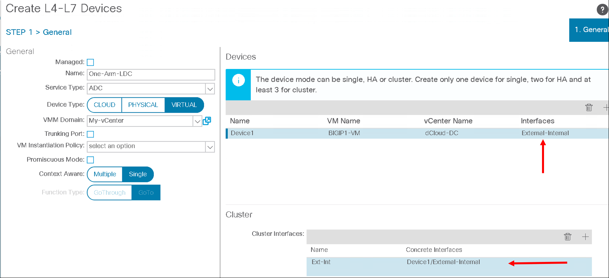
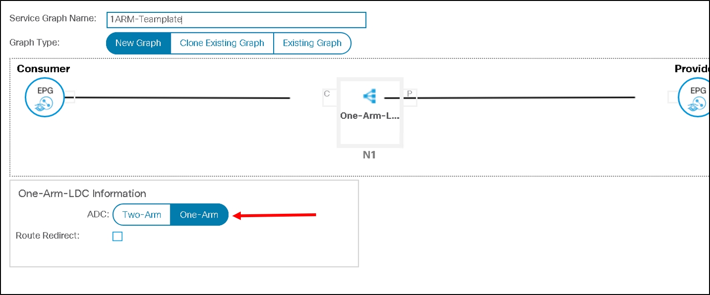
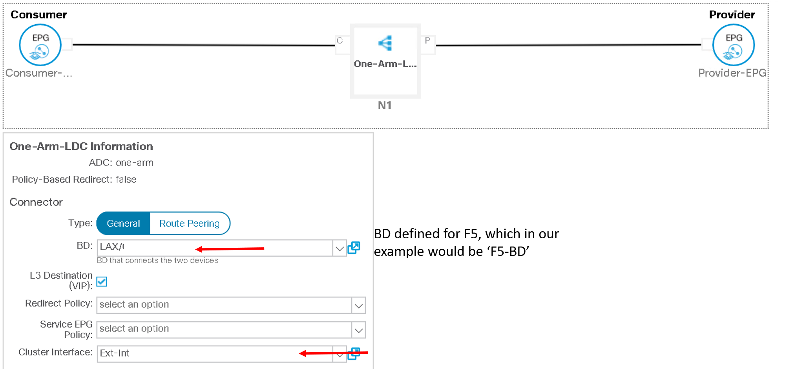

One-Arm Service Graph (OPTIONAL)
=================================================

The previous section went through the process of creating a two-arm graph on the APIC representing a two-arm deployment model on the F5 load balancer

Let's go over the difference between a one and two arm deployment model:

1) Two Arm Method

   - We use more than one interface of F5 Load balancer is used in this method of deployment.

   - For Physical Servers(workload) default gateway is F5 Load Balancer IP Address.

   - Asymmetric routing does not occurs in this method.

   - Client IP address is retained
 
   |

   .. image:: ./_static/two_arm.png
      :scale: 40 %

   |
   
2) One Arm Method

   - Only one interface of F5 Load balancer is used in this method of deployment.
   
   - For the workload the default gateway is not F5 Load Balancer IP Address but can be the ACI fabric

   - Source address translation needs to be configured on the F5 to avoid asymmetric routing 
   
     - Client IP is not retained (there are ways of retaining the client IP, that topic is out of scope for this lab)
   
       |
      
       .. image:: ./_static/one_arm.png
          :scale: 40 %     		 
      
       |
   
 
In this section we are going to look at the one arm configuration option as we have already covered the two-arm option
 
Let's take an example where the consumer EPG, provider EPG and the F5 EPG are all in seperate bridge domains

- Consumer EPG -> Consumer-BD

- Provider EPG -> Provider-BD

- F5 EPG -> F5-BD

.. note::

   Below are screenshots of how you can deploy it, you dont need to actually deploy the configuration
   
   This section is informational Only
   
   It is optional to create a dummy F5 subnet and dummy F5 EPG and work through the exercise below
   
   
One Arm graph Configuration - APIC
``````````````````````````````````

Create a logical device cluster. Instead of defining two interfaces under device define only one

|



|

Create a service graph template and choose 'one-arm' instead of 'two-arm'

|



|

When applying the service graph template choose the appropriate client and server EPG. 

When mapping the bridge domain, map it to the bridge domain of the F5

|



|

Once deployed the one-arm service graph is deployed
  
One Arm Configuration - BIG-IP
``````````````````````````````

Since we are only using one interface on the BIG-IP the following will need to be defined which can be done using the F5 ACI ServiceCenter

- One vlan which matches the vlan allocated by APIC when the service graph is deployed

- One Self-IP belonging to subnet range assigned to 'F5-BD'

- Default route to point to default gateway of subnet assigned to 'F5-BD'

That is the complete configuration needed to deploy F5 in one-arm mode

**That brings us to the end of this section and lab**